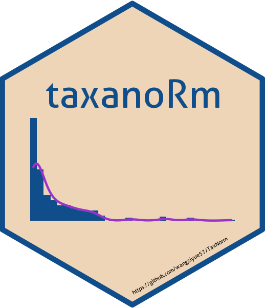

# TaxaNorm 
TaxNorm is the R package for a novel feature-wise normalization method for microbiome data based on zero-inflated negative binomial model. This method assumes that the effects of sequencing depth vary for each taxon on their mean and incorporates a rational link of zero probability and taxon dispersion as a function of sequencing depth to better capture the microbiome data nature.

## Installation


Current stable release:

```r
install.packages("TaxNorm")
```

Build from GitHub:

```r
if (!require(remotes)) install.packages("remotes")
remotes::install_github("wangziyue57/TaxaNorm", 
                        dependencies = TRUE, 
                        build_vignettes = TRUE)
```


## Citation
